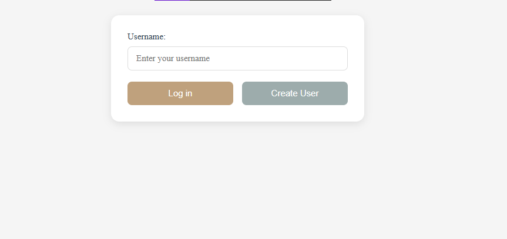
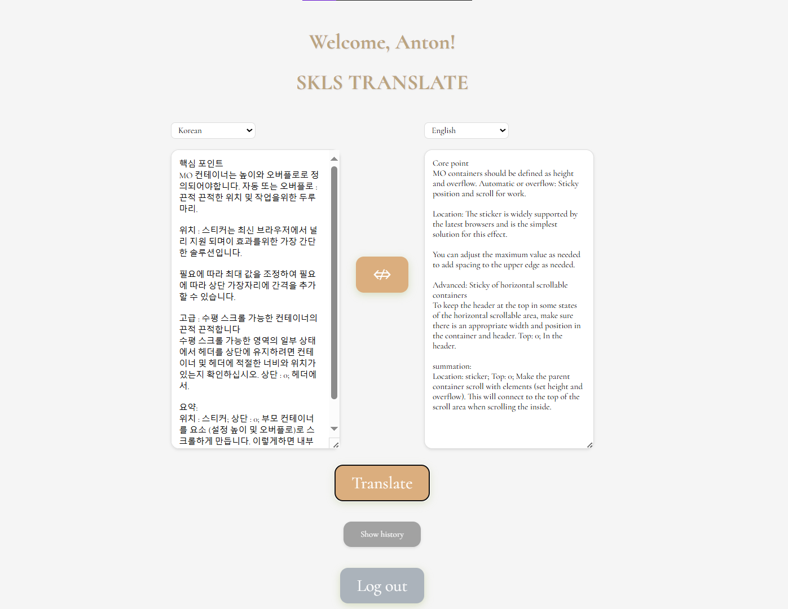
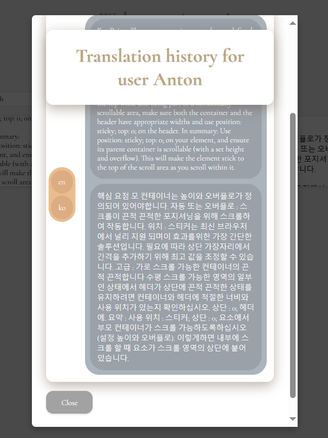

# Лабораторная №7, ПнаЯВУ  
### группа 334701 Вариант №13  

### ಠ_ಠ [By Anton Kozlov] ಠ_ಠ
---

### Сделал Web страничку для приложения.

### Страника логина
 

- Написал 2 шаблона для логин страницы и главного экрана.
- Между ними данные передавал через `jakarta.servlet.http.HttpSession`
- Для пользователя и его возни с сайтом сделал отдельный контроллер с `/` и `/login` эндпоинтами. Главная редиректит в логин, если данные сессии отсутствуют, страница логина заполняет их и возвращает на главную с готовой информацией о пользователе.

### Главная
 

- На главной:
    - Все для перевода
    - Кнопка выхода из сессии
    - Кнопка просмотра истории действий пользователя
- Дизай на чистом `HTML/CSS/JS` на глаз
### Pop out для истории переводов
 

- Для окошка истории 2 js функции:
    - Показать + подгрузить
    - Спрятать